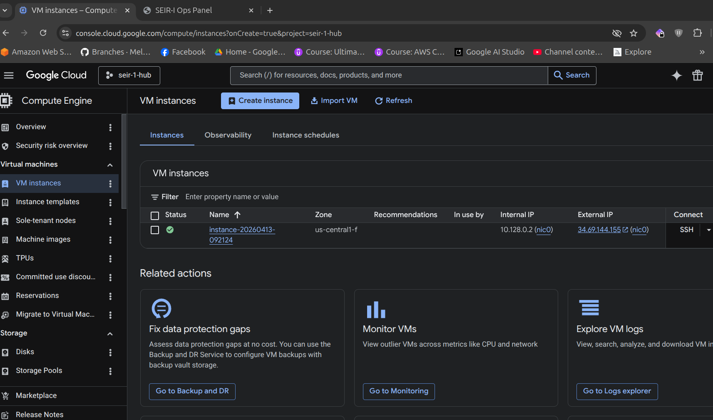
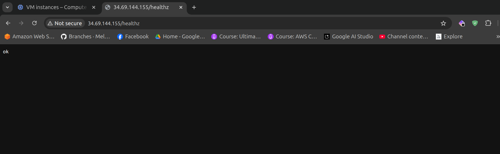
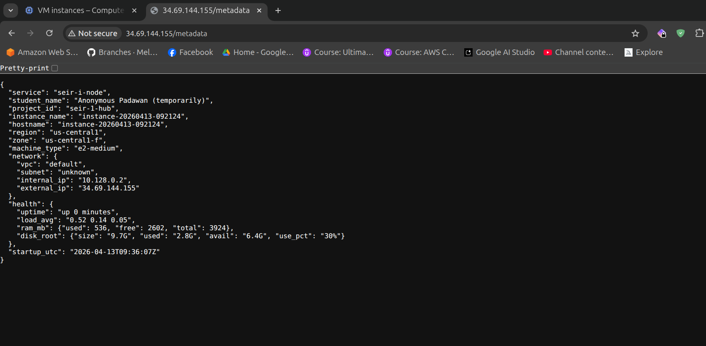
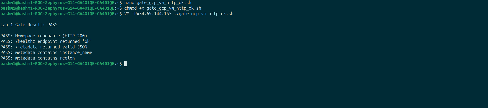

# Deliverables

Execution artifacts and gate validation outputs. Click any image to expand.

---

## Week 1:

### 1. Instance Provisioning
GCP Console with the running Compute instance.

 

### 2. Health Endpoint
Successful routing and response from `/healthz`.

 

### 3. Metadata Endpoint
JSON payload returned from the `/metadata` route.

 

### 4. Gate Validation
Passing output from the `gate_gcp_vm_http_ok.sh` script.

 

---

## Week 2: 

<!-- 
Template for Week 2:
###[Step Name]
[Brief note on what is shown]

-->